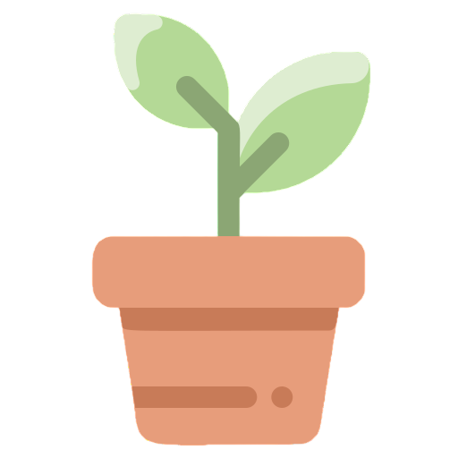

    

 

 
    <h2 style="border-bottom: 1px solid #d8dee4; color: #282d33;"> 👋 Welcome to My Github </h2>  
        
    
 
      안녕하세요. 사용자 친화적인 서비스 경험을 설계하는 프론트엔드 개발자 차유림 입니다.</li> 
    
 

     
    

 
    <h2 style="border-bottom: 1px solid #d8dee4; color: #282d33;"> 🎓Educations & Experiences </h2>  
        
 
             2024.01 ~ 2024.12 <b>삼성 청년 SW아카데미(SSAFY) 11기 이수</b>    
             2018.03 ~ 2023.02 <b>수학과 전공 / 응용통계학과 복수전공</b>
        

    

 
    <h2 style="border-bottom: 1px solid #d8dee4; color: #282d33;"> 👨‍💻 Project </h2>  
     
    <table align="center" style="table-layout: fixed; width: 100%; border-collapse: collapse;">
        <tr>
            <td align="center"></td>
            <td align="center"></td>
            <td align="center"></td>
            <td align="center"></td>
        </tr>
        <tr>
           <td align="center"><b><a href="https://github.com/oodongdan/ODD">우리동네단골</a></b></td>
                <td align="center"><b><a href="https://github.com/readygreen/readygreen">언제그린</a></b></td>
                <td align="center"><b><a href="https://github.com/Plober-Plog/Plog">PLog</a></b></td>
                <td align="center"><b><a href="https://github.com/chajoyhoi/MoFIN">MoFIN</a></b></td>
        </tr>
        <tr>
            <td align="center">2024.10 ~ 2024.11</td>
            <td align="center">2024.08 ~ 2024.10</td>
            <td align="center">2024.07 ~ 2024.08</td>
            <td align="center">2024.05 ~ 2024.05</td>
        </tr>
        <tr>
            <td align="center"><b>FE</b></td>
            <td align="center"><b>FE</b></td>
            <td align="center"><b>FE</b></td>
            <td align="center"><b>BE, FE</b></td>
        </tr>
        <tr>
            <td align="center">편의점/마트 재구매 상품 추천   앱 및 대시보드 서비스</td>
            <td align="center">신호등 잔여시간을 제공하는  도보 안내 서비스</td>
            <td align="center">식물을 키우는 사람들을 위한   SNS 서비스</td>
            <td align="center">금융 데이터를 활용한   금융 상품 비교 애플리케이션</td>
        </tr>
    </table>

    
    

 
    <h2 style="border-bottom: 1px solid #d8dee4; color: #282d33;"> 🏆Awards </h2>  
        
    
 
      <li> 2024.10 <b style="color: #7A7A7A;">삼성 청년 SW아카데미 특화프로젝트 우수상 </b></li>
      <li> 2024.05 <b style="color: #7A7A7A;">삼성 청년 SW아카데미 관통프로젝트 우수상 </b></li> 
    
 

 
 

    <h2 style="border-bottom: 1px solid #d8dee4; color: #282d33;">💻 Skill</h2> 
    

        <h3 style="border-bottom: 1px solid #d8dee4; color: #282d33;">Language & Framework</h3> 
        
        
        
         
        
        
        
         
        
        
        
        
         
        
            
    

     
    <h3 style="border-bottom: 1px solid #d8dee4; color: #282d33;">SUPPORT TOOL</h3> 
    

        
        
        
         
        
        
        
        
    

 
 

  <h2 style="border-bottom: 1px solid #d8dee4; color: #282d33;"> ✉️ Contact</h2> 
    
  
 
    
    
  
  
    

 
   
 

   
    

 
  <h2 style="border-bottom: 1px solid #d8dee4; color: #282d33;"> 🏅 Stats </h2> 
     
  
 
    

      
    

     
     
    
  

   

    
